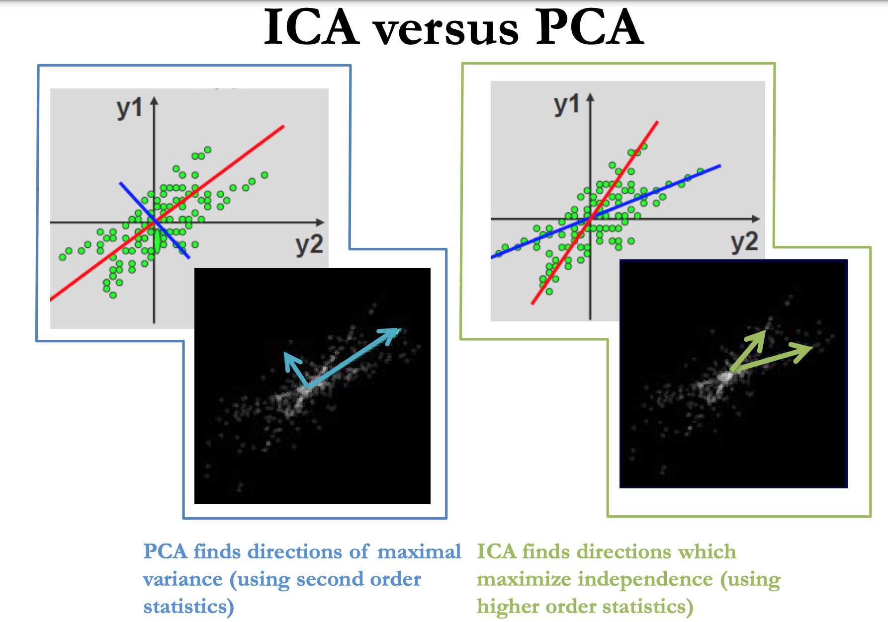

# ICA (see bottom for visualization)

See `ica.py` for usable implementation (`ica.ipynb` is for demonstration purposes)

Sources:

https://www.shadecoder.com/topics/ica-in-machine-learning-a-comprehensive-guide-for-2025

[ICA_JHU.pdf](extra/ICA_JHU.pdf)

Whereas principal component analysis (PCA) finds orthogonal directions in the data corresponding to the greatest explainable variance, **independent component analysis (ICA)** finds non-gaussian, statistically independent directions. ICA is unsupervised, and assumes that the original multivariate signal is a linear mixture of independent signals. The ICA process attempts to determine both the independent source signals and the mixing process for how they were combined.

If we have our observed data, $X$, the ICA model assumes that:

$$
X=As
$$

where $s$ is the random vector whose elements (components) are the sources and $A$ is the “mixing matrix”, which defines how much of each component of $s$ makes up each observation in $X$. We will return to this mixing matrix later, as keeping it in mind is important for the intuition behind ICA.

To begin, let us assume we have data $X \in M \times N$, where we have $M$ observations of a data vector of size $N$, where each observation $x_i$ is a linear mixture of independent signals. For ICA, the variance structure of the data is very important (we will get to why this is later); thus, we need to mean shift the data as to not obscure the covariance structure with bias. To illustrate, look what happens when we do not mean shift the data prior to PCA vs doing a mean shift:

Notice how when there is no mean shift, the primary eigenvector is dominated by the location of the mean of the data. This is because the covariance structure of the data was muddled with bias due to the absence of mean shift (the algorithm “thinks” that an $x$ increase correlates a TON with a $y$ increase, since there is a positive value of $y$ whenever there is a positive $x$).

Remember, the covariance of two random variables is:

$$
COV(a,b)=E[(a-\mu_a)(b-\mu_b)]
$$

To calculate the data covariance matrix $\Sigma \in M \times M$ of $X$, the equation is:

$$
\Sigma =COV(X)=\frac{1}{N}XX^T
$$

The next step in ICA is to make the covariance of the data equal to the identity matrix, which is called **whitening** the data.

Technically speaking, performing ICA without doing so is possible, but it severely limits the stability of the ICA model, which does not allow you to recover the independent components quite as well (and sometimes makes it impossible due to being underdetermined).

[Why whitening helps ICA](extra/why_whitening_helps_ica)

To whiten the data, we use eigenvalue decomposition (PCA) to get the principal directions of variance (or eigenvectors = $E$) and the associated variance values in those directions (or eigenvalues = $D$) for $X$. (i.e. eigenvalues are the variance of the data along the principal components).

First, we apply the eigenvector matrix to the data to “rotate” the data along the PCA axes. We then divide by the eigenvalue to normalize the variance to be 1 along the PCA directions. We then rotate back (optional?). This result gives us $\tilde{X}$, the whitened version of our data matrix$X$:

$$
\tilde{X}=D^{-1/2}E^TX
$$

where $D^{-1/2}$ is equal to the reciprocal of the square root of eigenvalues (the first $k$ for $k$ components) in a diagonal matrix. Note how this whitening will ensure that our new “whitened” mixing matrix will have the property $\tilde{A}^T\tilde{A}=I$:

$$
\begin{aligned}
\tilde{X} = \tilde{A}s
\\
\tilde{X}\tilde{X}^T = \tilde{A}s\tilde{X}
\\
\tilde{X}\tilde{X}^T = \tilde{A}ss^T\tilde{A}^T
\\
E[\tilde{X}\tilde{X}^T] = E[\tilde{A}ss^T\tilde{A}^T]
\\
E[\tilde{X}\tilde{X}^T] = \tilde{A}E[ss^T]\tilde{A}^T,\\ \text{since } \tilde{A} \text{ is constant}
\\
\end{aligned}
$$

Now, one VERY important property we must remember is that each component is assumed to be independent. Thus, the covariance (off diagonal) terms are zero for the covariance matrix of the source component signals. If we also assume the source components have unit variance, then:

$$
\begin{aligned}
E[\tilde{X}\tilde{X}^T] = \tilde{A}E[ss^T]\tilde{A}^T
\\
E[\tilde{X}\tilde{X}^T] = \tilde{A}I\tilde{A}^T
\\
I = \tilde{A}\tilde{A}^T
\end{aligned}
$$

See how the data turn into having a covariance of 0 after whitening:

(Must verify) It should be noted that when we have $k$ independent sources and $N$ observations where $N>k$, we only select the top $k$ eigenvectors/values for the whitening step. 

After these preprocessing steps (mean shift and whitening), we are now ready to actually estimate the independent components. At this point, we have reached another **critical assumption** of the ICA process. First, we are assuming that our original signals/components are not noise (e.g. not gaussian). Thus, we need to find the direction(s) along which we have the LEAST gaussian behavior. There are a few ways to do this, but the one I will mention here is **negentropy**.

Gaussian distributions have the highest **entropy**, a measure of uncertainty/randomness, of all distributions with equal variance, as they are the most random and least structured. Therefore, high entropy correlates with Gaussian-ness. Since we are trying to find directions in which we are LEAST gaussian, we need a measure of non-gaussian-ness. **Negentropy** is defined as:

$$
N(X) = H(X_{gaussian}) - H(X)
$$

where $H(...)$ is the entropy of a distribution. Thus, negentropy will be very high when $X$ is very non-gaussian. For example, if we visualize the distribution of a non-gaussian signal (e.g. Sine wave), we see that it is very non gaussian:

Unfortunately, computation of negentropy is computationally difficult/infeasible, so we often use an approximation of negentropy instead. This is frequently **kurtosis**, or the 4th moment of a distribution. However, when using kurtosis, which is $kurtosis=\frac{(x-\mu)^4}{\sigma^4}$, if we have a huge outlier in the data then the computation explodes ($x^4$ grows super fast).

Thus, we instead use a proxy function that grows quickly when near zero, but turns linear when further away (doesn’t blow up). This proxy (called the “Contrast Function”) $G(u)$ is often:

$$
G(u)=log(cosh(u))
$$

To recall from earlier, $\tilde{A}$ is our “whitened” mixing matrix that is orthogonal and normal. From this point on, for simplicity, we will be using $W$ instead of $\tilde{A}$, where $W=\tilde{A}^{-1}=\tilde{A}^{T}$:

$$
\begin{aligned}
Z=\tilde{A}s
\\
\tilde{A}^TZ=s
\\
WZ=s
\end{aligned}
$$

with $w$ as the individual vectors in $W$ that identify the independent sources. In the case for ICA, $u=w^TZ$, where $w$ is a vector in $W$ that identifies a source component, and we are trying to MAXIMIZE $G(...)$ across all our elements in $w^TZ$. Thus, are trying to find a $w$ by maximizing:

$$
M=E[G(w^TZ)]
$$

Through a lot more mathematical assumptions, approximations, principles, and matrix algebra, we end up iteratively searching for $w$ by updating via:

$$
w^+ \leftarrow E[Z g(w^T Z)] - E[g'(w^T Z)] w
$$

where $g(...)=G'(...)$. See the notes below for the derivation of this update formula.

[Derivation for Update Rule](extra/derivation_for_update_rule.md)

Since $G(x)=log(cosh(x))$, we have:

$$
\begin{aligned}
g(x) = tanh(x)
\\
g'(x)=1-tanh^2(x)
\end{aligned}
$$

There is one more key point that we need to take care of. Notice that we initialize $w$ randomly, and so it is very possible that in searching for each of the $k$ components, we find the same one(s) multiple times. Rather than repeating random initializations until we find unique ones, we can enforce our iteration process to find different $w$ each time, finding one after the other. This process is called “Deflation”, in which we subtract the already found $w$ vectors from the current one we are searching. Another approach, is a parallel computation approach, in which we find all components simultaneously (often more stable because errors do not propagate from one $w$ to the next).

To do so, we randomly initialize $W = \begin{matrix}
[w_1 & w_2 & ... & w_k]
\end{matrix}$ to an orthogonal matrix. We then apply **symmetric orthogonalization** to force the individual $w$ apart:

$$
\begin{aligned}
W \leftarrow W(W^TW)^{-1/2}
\\
OR
\\
W \leftarrow UV^T,
\\
\text{where}
\\
U,\_,V^T = SVD(W)
\end{aligned}
$$

(Side note: Remember, singular value decomposition of $W$ results in orthogonal and normal [orthonormal] vectors $U$ that span the column space of $W$ and orthonormal vectors $V$ that span the row space of $W$, where $W \in A \times B$ means $U \in \R^A$ and $V \in \R^B$. Span means that for any vector in the dimensional space, there is a linear combination of the vectors in the set can equal that vector.)

We can then update $W$ using the Newton-Raphson method until $W$ stops changing. After this, we can estimate our independent components via:

$$
s=WZ
$$

Remember, our transforms have all been linear. Thus, the $k$-dimensional space that we have been working in has just been a rotation and scaling of our original space (if $k < N$, then the space is a “lossy” version of the original data space, but for all intents and purposes, imagine it as a rotation of the original). To recover the mixing matrix $A$ (and simultaneously the version of $W$ in the orginal space, which is $A^T$), we can apply the reverse steps that we took to arrive at $W$. Remember, we did the following to transform the problem into our whitened space:

$$
\begin{aligned}
X=As
\\
(D^{-1/2}E^T)X=(D^{-1/2}E^T)As
\\
(D^{-1/2}E^T)X=Z=\tilde{A}s=(D^{-1/2}E^T)As
\\
WZ=s
\end{aligned}
$$

and thus we can invert the process to recover the original representation as explained:

$$
\begin{aligned}
WZ=s
\\
W(D^{-1/2}E^TX)=s
\\
(WD^{-1/2}E^T)X=s
\\
X=(WD^{-1/2}E^T)^{-1}s
\\
As=(WD^{-1/2}E^T)^{-1}s
\\
A=(WD^{-1/2}E^T)^{-1}
\\
A=ED^{1/2}W^T
\end{aligned}
$$

Where $A$ is the mixing matrix! 

Note that while the rows of $A$ represent the amount that each component contributes to a respective signal, the columns of $A$ represent the contribution of a single independent component to each observation. Thus, $A$, or $A^T$, essentially represents the “un-whitened” version of $W$.

- try implementation on audio data
- try on natural images of people?
- try on actual data from lab

# Other Notes

Video 1:

https://www.youtube.com/watch?v=wIlrddNbXDo

- ICA solves the blind source separation problem very well (what it was designed for)
    - Imagine you have a bunch of observed variables (observations) that are all determined by several independent/underlying variables
        - e.g. 3 different people talking near each other, each with a microphone close to them. The observations are the recordings that we hear from each of the 3 microphones as they are all talking, whereas the people themselves (their voices) are the underlying variables
    - ICA is designed to be able to separate out these independent voices/sources given the separate observations

Video 2:

https://www.youtube.com/watch?v=e4woe8GRjEI

- As before, ICA solves the blind source separation problem very well, whereas PCA does a terrible job with this
    - Think of it like this: PCA is trying to explain the variance that is present in the observed data. If you run PCA on the 3 microphone recordings, it will not separate out the three voices at all (think about it: the largest component would not be only one person’s voice, the second component would not be another person’s voice)
    - Another good example: eigenfaces —> PCA (on normalized faces) would have the 1st component being more or less the “average face”, which is not what ICA does at all. ICA would find noses, mouths, eyes, etc., because those are the things that are most different (?)
- Whereas PCA can yield the same result on a matrix and its transpose (bi-directional), ICA cannot (which one the observed variable is is important for ICA?)
- For natural scenes, ICA is really good at finding edges (Edge detectors)
- For documents, ICA will give you topics

Video 3:

https://www.youtube.com/watch?v=SjM2Qm7N9CU

- ICA is trying to maximize the mutual information between the generated features from ICA and the observed features from the data
- ICA does not yield ordered features (it is an unordered bag of features), whereas PCA does
- Overall, PCA and ICA are trying to do the same thing (model the observed data in an unsupervised manner), but their assumptions about the data are different

Link 1:

https://www.sci.utah.edu/~shireen/pdfs/tutorials/Elhabian_ICA09.pdf

- Given observed data X, ICA models this as:
    - $X=As$, where s is the random vector whose elements (components) are the sources and A is the “mixing matrix”
- The first assumption of ICA is that the components are statistically independent
    - this means that for any variables, the joint probability distribution is equal to the product of the probability distributions for each variable alone (i.e. the marginal probability distributions)
    - we must also assume that the components have a non-gaussian distribution

- One thing to note is that the magnitude of the components cannot be estimated (including sign)

- This slide deck has a very good illustration of how ICA is good at edge detection
